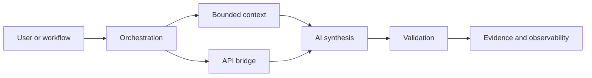

# Rien Regalado

I build practical AI and automation systems at the intersection of APIs,
workflow orchestration, operational data, observability, and infrastructure.
My work emphasizes bounded context, explicit validation, source provenance,
read-only defaults, evidence capture, and systems that can be supported after
the demo ends.

## Public project portfolio

### [MCP Operations Context Demo](https://github.com/rienregalado/mcp-operations-context-demo)

A synthetic, read-only context service with bounded search, revision-bound
fetch, traceable source IDs, content hashes, and ACL-aware publication rules.

### [n8n AI Workflow Demo](https://github.com/rienregalado/n8n-ai-workflow-demo)

A sanitized workflow export showing webhook intake, request validation, a mock
AI/service call, response validation, fail-closed handling, and evidence output.

### [API Bridge Health Demo](https://github.com/rienregalado/api-bridge-health-demo)

A FastAPI service pattern with health, readiness, version, schema, Prometheus
metrics, bounded upstream calls, retries, and automated tests.

### [AI Prompt Evaluation Harness](https://github.com/rienregalado/ai-prompt-eval-harness)

A deterministic evaluation harness for source grounding, abstention,
structured-output contracts, forbidden-action claims, and regression checks.

## Engineering themes

- local-first and privacy-aware AI patterns;
- REST/JSON API integration and service boundaries;
- n8n workflow orchestration and durable execution evidence;
- MCP and retrieval patterns with source attribution;
- PostgreSQL, object storage, metrics, logs, health checks, and runbooks;
- human approval and deterministic controls around consequential actions.

## About the repositories

The projects above use synthetic data and sanitized architecture. They are
public proofs of engineering patterns, not replicas of private client or
production environments.
