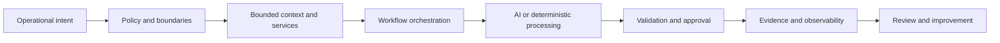

# Rien Regalado

**Owner / Principal at [Nexarion Technologies, LLC](https://github.com/Nexarion-Technologies)**  
Enterprise applications, systems integration, operational AI, workflow automation, data governance, and infrastructure operations.

I build practical systems that connect business operations, applications, APIs, automation, data platforms, observability, and AI without surrendering control of security, evidence, or supportability.

My background spans distributed IT operations, infrastructure modernization, Microsoft 365 and Azure administration, enterprise-application architecture, service integration, workflow orchestration, operational documentation, and field-facing technology. I previously supported technology operations across 25 locations, approximately 300 users, and roughly 1,000 endpoints while coordinating four internal technicians and three contractor groups. I am most useful where software, infrastructure, and real operating constraints collide.

## Current focus

- **Enterprise applications:** application portfolios, ERP/CRM boundaries, source-of-truth ownership, data stewardship, integration roadmaps, and supportable operating models.
- **Operational AI:** bounded context, source provenance, read-only defaults, structured outputs, evaluation, and human approval around consequential actions.
- **Workflow engineering:** n8n orchestration, validation, retries, exception handling, evidence records, and supportable runbooks.
- **API and service integration:** REST/JSON services, bridge patterns, authentication boundaries, health/readiness endpoints, metrics, and durable state.
- **Data and observability:** PostgreSQL, object storage, Redis, logs, metrics, dashboards, smoke tests, and traceable operational evidence.
- **Security and resilience:** least privilege, credential custody, approval gates, backup and restore planning, incident readiness, and documented change control.

## Nexarion Technologies

[Nexarion Technologies](https://www.nexariontechnologies.com/) is an owner-led technology operations and engineering company built around a simple premise: technology should behave like a system, not a pile of emergencies.

Its **Keystone** operating model connects visibility, policy, secure platforms, automation, audit, resilience, and continuous improvement. The public description is intentionally high-level; private specifications, client environments, and implementation details remain private.

## Public engineering portfolio

### [Enterprise Applications, Integration & Governance](portfolio/enterprise-applications-integration-governance.md)

A sanitized case study connecting multi-site operations, application roadmaps, ERP/CRM architecture, integration engineering, data stewardship, vendor and leadership practices, and governed automation.

### [MCP Operations Context Demo](https://github.com/Nexarion-Technologies/mcp-operations-context-demo)

A synthetic, read-only MCP service demonstrating bounded search, revision-bound fetch, source identifiers, content hashes, and conservative publication controls.

### [n8n AI Workflow Demo](https://github.com/Nexarion-Technologies/n8n-ai-workflow-demo)

A sanitized workflow demonstrating webhook intake, input validation, a synthetic service call, response validation, fail-closed paths, and evidence output.

### [API Bridge Health Demo](https://github.com/Nexarion-Technologies/api-bridge-health-demo)

A production-shaped FastAPI bridge pattern with health, readiness, version, schema, metrics, bounded upstream access, retries, trace IDs, and tests.

### [AI Prompt Evaluation Harness](https://github.com/Nexarion-Technologies/ai-prompt-eval-harness)

A deterministic evaluation harness for source grounding, abstention, read-only posture, forbidden action claims, structured-output contracts, and regression gates.

## Engineering approach

The recurring themes are straightforward:

1. define the boundary before building the automation;
2. keep source and execution authority separate;
3. validate inputs and outputs explicitly;
4. preserve provenance and evidence;
5. make failure visible and recoverable;
6. leave enough documentation for someone else to support the result.

## Public and private work

The repositories linked here use synthetic data and sanitized architecture. They are public proofs of engineering patterns, not mirrors of private GitLab repositories, client environments, credentials, internal topology, or production exports.

I remain open to employment, technical partnerships, and collaboration where practical systems engineering matters more than decorative AI claims.
